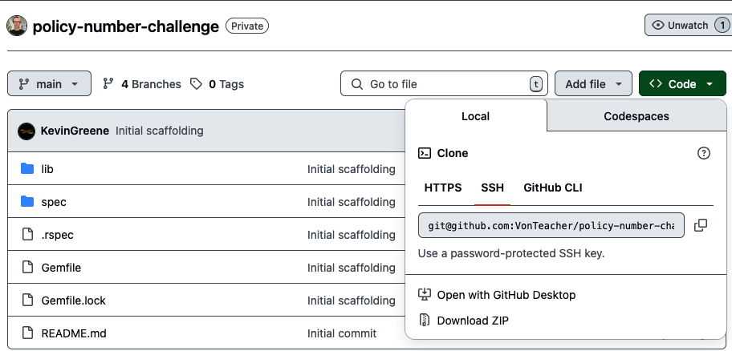
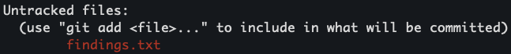
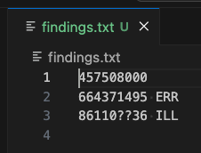

# Kin's Policy OCR Coding Challenge

Hello! And thanks for checking this repository. Below, please find details on how to run this project locally.

## Instructions
1. Clone the repository (SSH recommended)
```bash
git clone git@github.com:VOnTeacher/policy-number-challenge.git
```



2. CD into the directory
```bash
$ cd policy-number-challenge
policy-number-challange git:(main)
```

3. Ensure you are running `ruby 3.3.x`
```bash
$ ruby -v
ruby 3.3.4 # your results may differ
```

3a. Bundler Caveat
- You should not have to run `bundle` as no gems were added to this project to complete it. However, if you do run into issues, you will have to ensure that your Bundler version is compatible with later versions of Ruby. This can usually be completed with a `bundle update --bundler` command.

4. Make the `ocr_parser.rb` file executable, just in case
```bash
$ chmod +x ./lib/ocr_parser.rb
```

5. Use `bin/run_example` or run the parser with the following options
```bash
$ bin/run_example
OR
$ ./lib/ocr_parser.rb --include-status spec/fixtures/user_story_3.txt
```

You should see a `findings.txt` created in your root directory, with results in line with example provided from the project documentation. Or you can `cat findings.txt` to display results in the command line.



